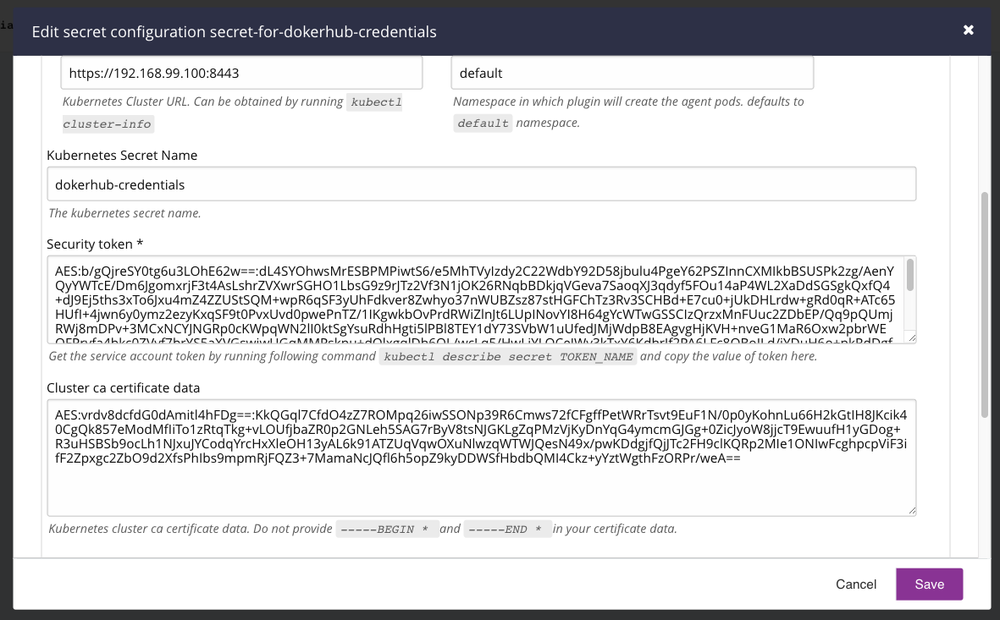

# Kubernetes Secrets plugin for GoCD

This plugin allows users to refer to [Kubernetes Secrets](https://kubernetes.io/docs/concepts/configuration/secret/) as a secret for GoCD.

### Configure the plugin

The plugin requires secret config in order to connect with the kubernetes secret - 

```xml
<secretConfigs>
        <secretConfig id="k8s" pluginId="cd.go.contrib.secrets.kubernetes">
          <configuration>
            <property>
              <key>kubernetes_secret_name</key>
              <value>mysecret</value>
            </property>
            <property>
              <key>kubernetes_cluster_url</key>
              <value>https://192.168.99.100:8443</value>
            </property>
            <property>
              <key>security_token</key>
              <encryptedValue>AES:niGQ6YZzkMfMCZbmG97VFg==:6n5Gdqu3LPPuGUI8YF769iTTdFmuDLJBhABUy//UKDiWV+wilqd7UiWadUFwiTHbb+694wIz6+mAe8alvhzdKzZAo+xHDyE+hdg7mcMOJ2LU7RA4uvFPtujRhZgYFvl5OpqWfmQodu+08WcUqU+ITOfSsThyK7/+CjrAwrc/iusHyG+vQ8m4lQ85kymLGhrVkZQsLPWHnQB2O05r2JQJZZClNABlsccHISh0vKuITa544GUX12ulPi2xx0gm4cA5Nd9RJxHRNhlOWzCMXiNF30EsSjnN/tqFdPud33uw1Fm34R9jgPsB7LAii9HRmZYHbc6rvZuERpOqd+cnjMsyFNqTEqGwOdlQCIrbKw+Z4/0FCCmqJbMwenI+czU8lWg9NlxsoMOVf9WqlB0uaDAT3/NEKaWY6uCrjvPU7OlBhJ1ufB0+49/EPGH0NGZ7DTrzM5h3s54U4T0U4t4OPwD10xVFAHHudv8UFq8afRM5GyQCHLzA5Mni17miBPcuicKWse5/FTUR+kJSECY7KDdH/eW5TxyRDmv1GAzxl985QRHza6xsymhcFlm/3feWiZHnSmInTnUc9Uq7fVuhn725aaTmYUZmnjvZ/UZoHvmEjqN553hF7TGTydkakwQTW87kfYS+YEf+pxz95E6e6D9VMHAa3+csBKEaU+2MMEcOb4f0XC2I96Q74u+st98fR0s6k+nkQX+Yhfh1RVPl3BRFnuWglhqzvQG4wdluKzRbZBT0zyaKugzNfn8Q61UBui4AelNsmHXpEyr9f4lOFymdgUuia/bNbDJGXdjB9Xj0lFRH+PyoDNpimlT6wAXf0bcmVj+OXFepioVqLzeYjjM/AMVwjs3FXU6TbNEPTUazOkxVHDKRyZ7Rs28udxrx7/qJMYLKCrTnDSdZdcK+woem/ViqcdCkFsz5DrTRBpX3MlU2KD61HdEadZDFqg+cP7JO1QxYUklBXl2IJGeL1USW1bCncxmEkYNaYVSTqbqnnGYog5JuVm6Tcd1tVfAEjuSiFlmzRoIC8HjncqVH086MfzYM4+8t+O0PHvtilldQlC24SVgqlHf5OpPPUuWxZOeNFheRPX3vCrwDFrHTCykuM3MoYPZid56y5I1O2Pc1zEc=</encryptedValue>
            </property>
            <property>
              <key>kubernetes_cluster_ca_cert</key>
              <encryptedValue>AES:Vub2rXf0xa4d79JTgXs3TA==:sIl/nCHhnAVOH1/+AXkcowfKQHN1ZOLybWyvytNwV4s8v3Iq0+Jp+MGEtAxSImcBsaf/riUhjFaji6T5WILfzyhs1WlwSzsHTfAOhRZir9OLBVw/wUa9d8eeA0s1y2fUUKjqo9BnswGMnB6GzMQwqUoDZ+ui7SPQl3KPICu5KSBlDc9+uhxMH3DhmhSPRrKpVT/7c4xOMR36/Exlzp3IXkGQISCHs/AL5McPUXAFx4nwGzoFEXROpVMFycm5tHt4hd8sa8hRmFpVavcHBIHHF9QAnFX8RPefHV2aGEwBRiYQFee7oPqDhlnfSP6zgTbADYPtDZK2RuOxeM7JFtVUNpgMfsqk2Q8jA/tICdvl0sQvowHuihSyH4O+kano0kxYzNVNQTLs7qhzbB5MGob+3+TEUXrgGjkgFQ5gyER3mn6JsVwZpIHbr4q1dfKkwl59K3UjserxtNbBvS2CfMBFbXs+/yTGEzs+nn06lhlEwkAtaBVTjWaCP5iCCvkEGZQ1FB48cV+o1Pup1zZvWtk1ELle9fY2JxrOd4wo8l78lsMKi5IeuICVr25NAt6upvnJVATybQgaCErOoGDbZalcrNY282y2Q8ohU6/yEKjo6f6fCVWPUaCkz97HkHOfSbpxMEzbI8CnUsAHd+0oZmvAzMTyvFTl+lgmIhEY7JnkJwIefuHfcSOuzpiJB4pXhcooNd4Xug4D7rDXf/9M0sUwbaoA88lvXdtvz01e82xW7gCPxsvrJkJ3+NQxJw0lwZcPKgQfpSc6xTdwaiO3LMqSiPFL9FAq0/u/Le4FztNOxGomrkugtGYMtaqqXerQ6wKStYuhgIyKugffRlaQVBXSb6a58Rm8MrlzRXHqPCaMoCviblYWAIhQ9llsFwFVzD1wmSOkDC6BhG067TwjOL4SZPruLk78UFwEsyUSdez6zstQLj6LdjNbskuDyanOGdF2CY02zut0GlpXIGS8wA0SwudKf+15dTCAG00RSoPk8jYZ1rxC1hPwSXLN6xyFQlWTHLzg7X+jez3V8VOO+LmBJdWqfSPMCEZDeRONl08UVW9iCWJCI1wSSq+Ci8Q1ysTE1QYUDCTRxcSAvjof30i+49tvwet4OsrKzknh+tRTKcx1xVsJ9Spm8D+ZIddWeWKYteel6ZgX4yoUtA4staGhEQ/HOZwzfV382f2A/PFYmbElfP1ooq8L6UBtWH0BlTOKUUX+SiTUyVkgFqTWyT1ikyiS/rY0K0XElLWUVjc0qeYrn2Xh7zG/fG099oWIhMdbJ+yE6s2MBAd+kjmkBE4DuMmyJK6qJRjyVgOgbnx1kZtdg5BaC9TEVwLTkF0QrzEH</encryptedValue>
            </property>
            <property>
              <key>namespace</key>
              <value>default</value>
            </property>
          </configuration>
          <rules>
            <allow action="refer" type="*">*</allow>
          </rules>
          <description />
        </secretConfig>
  </secretConfigs>
```

| Field                      | Required  | Description                                                                    |
| -------------------------- | --------- | ------------------------------------------------------------------------------ |
| kubernetes_secret_name     | true      | The kubernetes secret name that needs to accessed within GoCD.                 |
| kubernetes_cluster_url     | true      | The kubernetes cluster url.                                                    |
| security_token             | true      | The security token having enough permissions to access the kubernetes secret.  |
| kubernetes_cluster_ca_cert | false     | The kubernetes cluster CA certificate.                                         |
| namespace                  | false     | The kubernetes namespace where kubernetes secret reside.                       |

### Building the code base
To build the jar, run `./gradlew clean test assemble`

### Example

1. Create a kubernetes secret with desired name and appropriate data. For example: Let's create a kubernetes secret with name `dokerhub-credentials`, containing `username`  and `password` as data items.  
```shell
$ cat secrets.yaml
apiVersion: v1
kind: Secret
metadata:
  name: dokerhub-credentials
type: Opaque
data:
  username: YWRtaW4=
  password: MWYyZDFlMmU2N2Rm
```

```shell
$ kubectl create -f secrets.yaml
secret "dokerhub-credentials" created
```

```shell
$ kubectl describe secret/dokerhub-credentials
Name:         dokerhub-credentials
Namespace:    default
Labels:       <none>
Annotations:  <none>

Type:  Opaque

Data
====
password:  12 bytes
username:  5 bytes
```

2. Configure a GoCD secret (named `secret-for-dokerhub-credentials`) to to point to `dokerhub-credentials` secret.





3. Use the configured secret config in an environment variable of a job. lets say, we want specify `DOCKERHUB_USERNAME` as an environment variable pointing to the `username` data from the `dokerhub-credentials` kubernetes secret, we can configure an environment variable on the job with key being `DOCKERHUB_USERNAME` and setting the value to `{{SECRET:[secret-for-dokerhub-credentials][username]}}`, where `secret-for-dokerhub-credentials` is the secret config id and `username` is the data attribute from the kubernetes secret. 


## Troubleshooting

### Enable Debug Logs

#### If you are on GoCD version 19.6 and above:

Edit the file `wrapper-properties.conf` on your GoCD server and add the following options. The location of the `wrapper-properties.conf` can be found in the [installation documentation](https://docs.gocd.org/current/installation/installing_go_server.html) of the GoCD server.

```properties
# We recommend that you begin with the index `100` and increment the index for each system property
wrapper.java.additional.100=-Dplugin.cd.go.contrib.secrets.kubernetes.log.level=debug
```

If you're running with GoCD server 19.6 and above on docker using one of the supported GoCD server images, set the environment variable `GOCD_SERVER_JVM_OPTIONS`:

```shell
docker run -e "GOCD_SERVER_JVM_OPTIONS=-Dplugin.cd.go.contrib.secrets.kubernetes.log.level=debug" ...
```

#### If you are on GoCD version 19.5 and lower:

* On Linux:

    Enabling debug level logging can help you troubleshoot an issue with this plugin. To enable debug level logs, edit the file `/etc/default/go-server` (for Linux) to add:

    ```shell
    export GO_SERVER_SYSTEM_PROPERTIES="$GO_SERVER_SYSTEM_PROPERTIES -Dplugin.cd.go.contrib.secrets.kubernetes.log.level=debug"
    ```

    If you're running the server via `./server.sh` script:

    ```shell
    $ GO_SERVER_SYSTEM_PROPERTIES="-Dplugin.cd.go.contrib.secrets.kubernetes.log.level=debug" ./server.sh
    ```

* On windows:

    Edit the file `config/wrapper-properties.conf` inside the GoCD Server installation directory (typically `C:\Program Files\Go Server`):

    ```
    # config/wrapper-properties.conf
    # since the last "wrapper.java.additional" index is 15, we use the next available index.
    wrapper.java.additional.16=-Dplugin.cd.go.contrib.secrets.kubernetes.log.level=debug
    ```

The plugin logs are written to `LOG_DIR/plugin-cd.go.contrib.secrets.kubernetes.log`. The log dir 
- on Linux is `/var/log/go-server`
- on Windows are written to `C:\Program Files\Go Server\logs` 
- on docker images are written to `/godata/logs`

